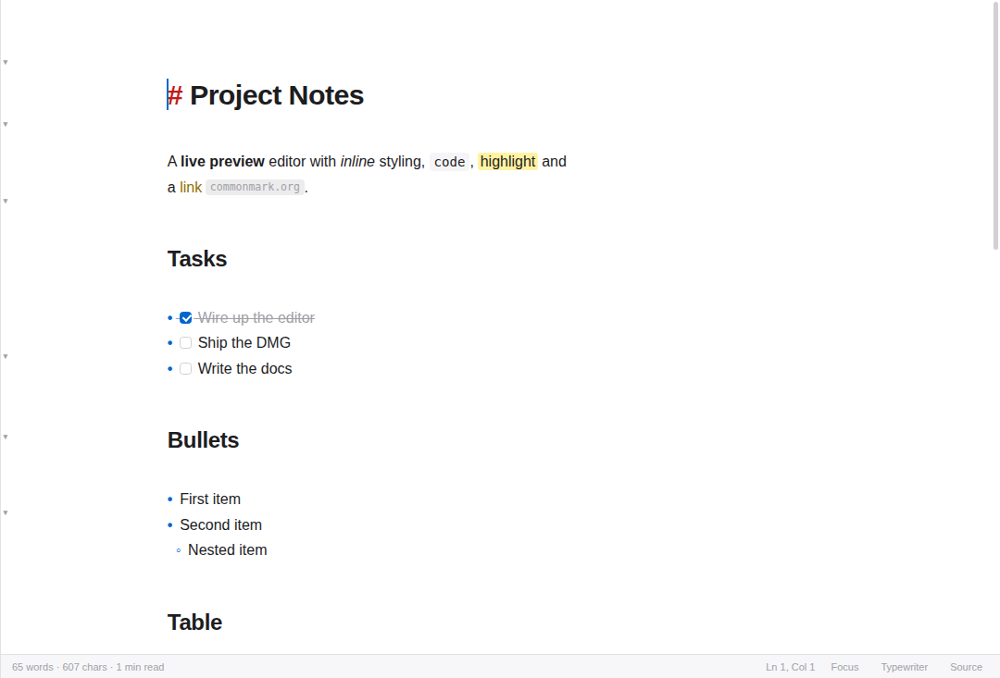
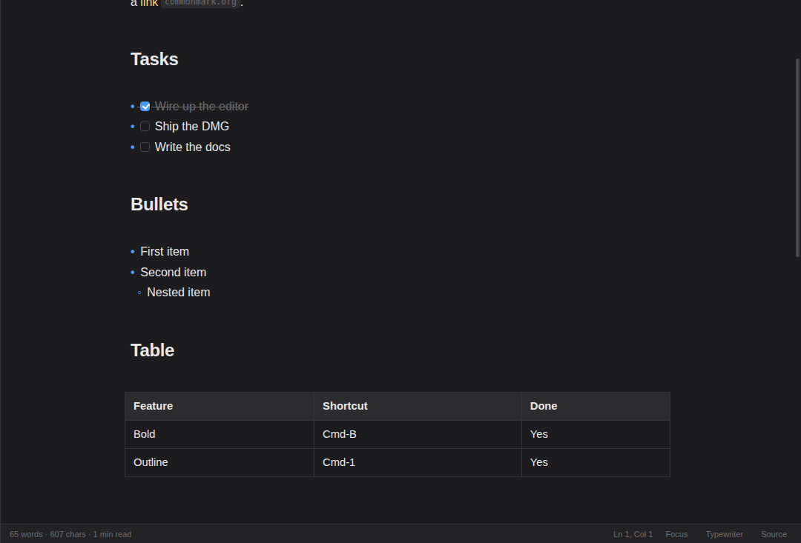
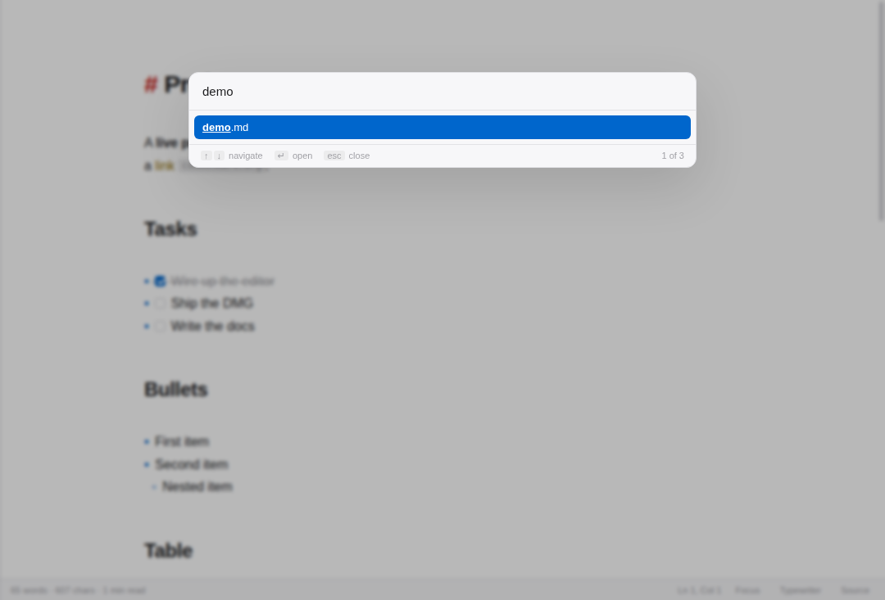

# Notepad MD

[](https://github.com/jun-bit-pulse-ai/md-file-notepad/actions/workflows/ci.yml)

A live-preview Markdown reader and editor for macOS.

You write plain Markdown and it styles itself as you type — headings grow,
`**bold**` turns bold, tables and math render in place. Move the cursor into
any element and its raw syntax reappears so you can edit it. There is no split
pane and no preview toggle: one editable, rendered document.

<p align="center">
  
  <br>
  
</p>

## Features

**Editing**

- Live preview for headings, emphasis, inline code, highlights, links, images,
  blockquotes, lists, rules and fenced code (with syntax highlighting)
- Tables render as real tables; put the cursor inside to edit the pipe source
- `$inline$` and `$$display$$` math via KaTeX
- Clickable task-list checkboxes that rewrite the underlying Markdown
- Enter continues lists, renumbers ordered ones, and ends the list on an empty item
- Multi-cursor editing, and formatting commands that toggle symmetrically
- Pasting rich text converts it to Markdown
- Spell checking as you type, with right-click suggestions and "Add to
  Dictionary" — code blocks and inline code are excluded, so identifiers
  aren't flagged as typos

**Reading**

- Outline sidebar that tracks the cursor (`⇧⌘1`)
- File-browser sidebar for the current folder (`⇧⌘2`)
- Focus mode dims everything but the current paragraph (`⇧⌘F`)
- Typewriter mode keeps the caret centred (`⇧⌘T`)
- Word count, character count and reading time in the status bar
- Quick Open (`⌘P`) fuzzy-searches every Markdown file under the current
  document's folder

**macOS integration**

- Native menu bar with the standard shortcuts, and a chromeless
  hidden-inset title bar
- Follows the system light/dark appearance, or pin either one
- Proxy icon, "Edited" title state, and unsaved-changes prompts on close
- Open Recent, `.md` file associations, and drag-and-drop to open
- Reloads the document when it changes on disk (unless you have unsaved edits)
- Export to Word (.docx), HTML and PDF
- Preferences sheet (`⌘,`) for appearance, text width, font size, spell
  check and autosave
- Optional autosave, a couple of seconds after you stop typing

## Keyboard shortcuts

| | | | |
| --- | --- | --- | --- |
| `⌘B` | Bold | `⌘/` | Toggle source mode |
| `⌘I` | Italic | `⇧⌘F` | Focus mode |
| `⌘E` | Inline code | `⇧⌘T` | Typewriter mode |
| `⇧⌘X` | Strikethrough | `⇧⌘1` | Outline sidebar |
| `⇧⌘H` | Highlight | `⇧⌘2` | File sidebar |
| `⌘K` | Insert link | `⌘F` | Find |
| `⌘1`–`⌘6` | Heading level | `⌥⌘F` | Find and replace |
| `⌘0` | Paragraph | `⌘+` / `⌘-` | Zoom text |
| `⇧⌘8` | Bullet list | `⌘N` | New document |
| `⌘P` | Quick Open | `⌘,` | Preferences |
| `⇧⌘7` | Numbered list | `⌘O` | Open |
| `⇧⌘9` | Task list | `⌘S` | Save |
| `⇧⌘D` | Toggle task done | `⇧⌘S` | Save As |
| `⇧⌘Q` | Blockquote | `⌥⌘R` | Reveal in Finder |
| `⌥⌘C` | Code block | `⇧⌘V` | Paste as plain text |
| `⌥⌘T` | Table | `⇧⌘C` | Copy as Markdown |
| `⌥⌘H` | Horizontal rule | | |

The same list is available in the app under Help ▸ Keyboard Shortcuts.

<p align="center">
  
</p>

### Quick Open

`⌘P` searches every Markdown file under the current document's folder, matching
on a subsequence: `srclp` finds `src/renderer/editor/livePreview.js`. Ranking
favours consecutive runs, word starts and the filename over the directory path,
so the obvious match lands first. The walk skips `node_modules`, `.git` and
friends, and is bounded on both depth and file count so a huge folder degrades
to "the first N files" instead of stalling.

## Getting started

```bash
npm install
npm start
```

`npm start` builds the renderer bundle and launches the app.

## Building a .app / .dmg

```bash
npm run dist
```

This produces universal `.dmg` and `.zip` installers in `dist/` for both Apple
Silicon and Intel. The build is unsigned by default — to ship it to other
machines, set `CSC_LINK` and `CSC_KEY_PASSWORD` for signing and
`APPLE_ID` / `APPLE_APP_SPECIFIC_PASSWORD` / `APPLE_TEAM_ID` for notarisation,
which electron-builder picks up automatically.

For a local unpackaged build, `npm run dist:dir` is faster.

## Development

```bash
npm run watch   # rebuild the renderer on change
npm run dev     # build once, then launch
npm test        # 174 unit tests
npm run smoke   # boot the real app headlessly and screenshot it
```

The unit tests cover outline extraction, document statistics, the formatting
commands, file I/O, the preference store, the spell-check menu, fuzzy file
matching, the recursive file walk, and the Markdown-to-Word mapping. They run on plain Node with no browser or Electron.

`npm run smoke` launches the actual main process, preload and renderer under a
virtual display, asserts the editor mounted with no console errors, and writes
a PNG. Flags:

| Flag | Effect |
| ---- | ------ |
| `--out <path>` | Where to write the screenshot |
| `--scroll <px>` | Scroll before capturing, to inspect content below the fold |
| `--theme light\|dark` | Force a theme instead of following the OS |
| `--export-docx <path>` | Run the Word export end to end and write the file |
| `--settle <ms>` | Wait longer before capturing |
| `--exercise-ui` | Drive Quick Open and Preferences, and report what opened |
| `--keep-palette` | Leave Quick Open on screen (for screenshots) |

A Markdown file passed as a positional argument is opened on launch. On a Mac
with a display, use `npm run smoke:mac`.

## Continuous integration

`.github/workflows/ci.yml` runs on every push to `main` and every pull request:

| Job | Runner | What it proves |
| --- | ------ | -------------- |
| Unit tests | Ubuntu | The 174 tests pass and the renderer bundle builds |
| Headless smoke test | Ubuntu | The real app boots under Xvfb with no console errors, Quick Open and Preferences open and work, and a `.docx` export round-trips |
| Package macOS app | macOS | `electron-builder` assembles a real `.app` with an executable, an `Info.plist`, and the `.md` file association intact |

The smoke job uploads its screenshot and exported document as artifacts, so a
failure can be inspected rather than guessed at. The macOS job builds unpacked
(`--dir`) and skips code signing, so it needs no certificates.

## How it works

```
src/main/       Electron main process — windows, menu, dialogs, file I/O
  main.js       Lifecycle, IPC handlers, window/document bookkeeping
  files.js      Atomic writes, directory listing, disk watching
  store.js      JSON preference store
  menu.js       Native application menu
  spellcheck.js Spell-checker configuration and the right-click menu
  preload.js    The renderer's entire privileged surface (contextIsolation on)
src/renderer/   UI (CodeMirror 6)
  editor/
    livePreview.js  The decoration engine — the core of the app
    commands.js     Markdown formatting commands
    widgets.js      Rendered tables, images, math, checkboxes
    modes.js        Focus and typewriter modes
  lib/            Pure logic: outline, stats, Markdown rendering, export
    docx.js       Markdown-to-Word conversion
    fuzzy.js      Subsequence matching and ranking for Quick Open
  ui/             Sidebar, status bar, Quick Open palette, preferences
```

The live preview works by decorating the editable text rather than rendering a
copy of it. `livePreview.js` walks the Markdown syntax tree over the visible
range and hides syntax markers, styles spans, and swaps some nodes for rendered
widgets — except where the selection touches, which stays as source. Block-level
replacements (tables, display math) come from a state field, because CodeMirror
requires block decorations to be known before the viewport is measured.

The renderer runs with `contextIsolation` on, `nodeIntegration` off, and a
restrictive CSP. Markdown is rendered with inline HTML disabled, so opening
someone else's file cannot execute script.

### Word export

`lib/docx.js` converts in two steps: `parseBlocks` turns the Markdown token
stream into plain block descriptors, and `buildDocument` maps those onto Word
structures. Keeping the first step free of the docx library is what makes the
mapping directly unit-testable.

Headings, emphasis, links, tables, ordered and bulleted lists, task state,
blockquotes, code blocks and rules all map onto native Word features rather
than being flattened into styled text. Local images are embedded at their
intrinsic size, scaled to fit the text column; an image that can't be read
degrades to a caption rather than disappearing. Math is exported as its LaTeX
source in a monospace run — Word's equation format (OMML) is not generated.

### Spell checking

Chromium does the checking on the editable surface. On macOS that means the
system speller, which picks the language itself; language selection only
applies on Windows and Linux. `spellcheck.js` keeps the context-menu shape as
a plain template array so it can be tested without launching Electron.

## License

MIT
